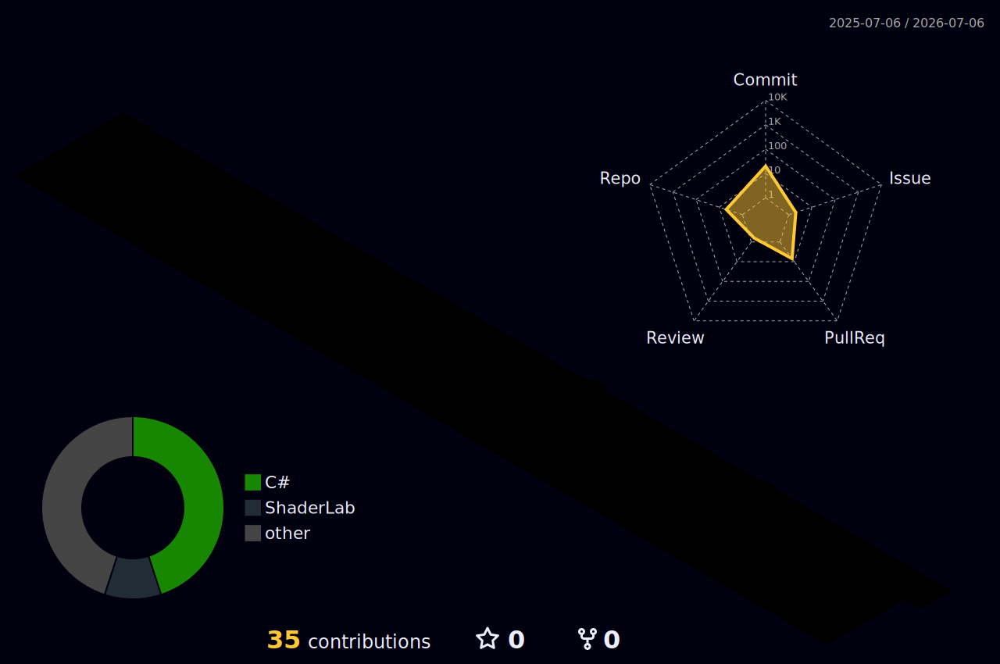

<h1 align="center">Hi 👋, I'm Akshat</h1>
<h3 align="center">Computer Engineering Student | AR/VR Enthusiast | Game Dev Explorer</h3>

  

---

## About Me

 First-year Computer Engineering student at **Army Institute of Technology**

 Active member of the campus **AR-VR / GDXR Club**

 Passionate about Indie Games, Game Development & Interactive Systems  

 Speedcubing enthusiast, escape room strategist, and Geometry Dash grinder  

 Exploring low-level programming, Unity systems, and interactive software design  

---

## 🛠️ Tech Stack

###  Programming Languages

---

###  Game & Creative Tools

---

##  3D Contribution Graph

---

##  Interactive Connect 4

Click below to drop a move 👇  

[Play Connect 4](https://github.com/Akshat-Yadav09/Akshat-Yadav09/issues/new?title=connect4%7Cdrop%7C0)

The board updates automatically using GitHub Actions.

---

##  GitHub Stats

  
  

---

   Building systems. Designing experiences. Leveling up daily.

